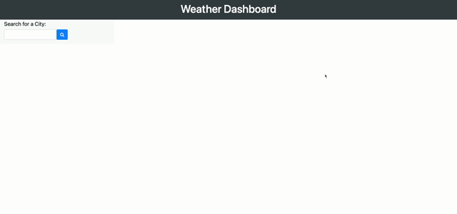

# ServerSide Weather-Dashboard App

---

## A Single Page Weather dashboard app that retreives data from OpenWeathers API.

Currently deployed at [GitHub Pages](https://mrjacoughlin.github.io/Weather-Dashboard-App/.)

---

## This application allows the users to input a city, Local storage will save this data, if search multiple cities this application will save recent searches and allow the user to select them again.
